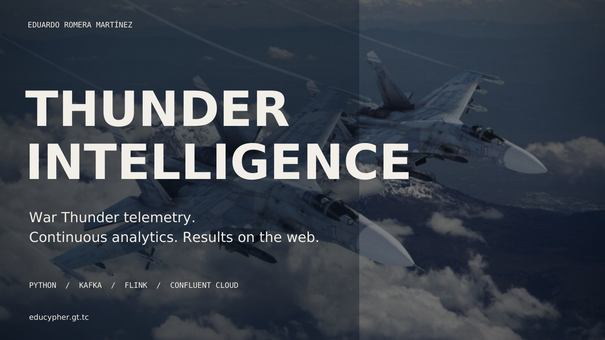

# Thunder Intelligence

**Real-time War Thunder telemetry analytics · Python · Confluent Cloud · Apache Kafka · Apache Flink**

[](./Thunder_Intelligence_Presentation_EN.pdf)

### Explore the project

[**Open the project on my portfolio →**](https://educypher.gt.tc/)  
On the website, open the **Projects** section, find **Thunder Intelligence** and select **“Ver proyecto”** (View project). The portfolio offers additional material and context alongside this downloadable program.

[**View the complete presentation (PDF) →**](./Thunder_Intelligence_Presentation_EN.pdf)  
GitHub opens the PDF in its file viewer. The final page includes a QR code pointing to the portfolio.

[**Download the project ZIP →**](./Thunder_Intelligence_Project_Public.zip)  
Download the ZIP, extract it and read `PUBLIC_RELEASE_NOTES.md`. It contains the program and its media library, **not** private Confluent credentials, the local Python environment, or personal gameplay history.

### How it works

```text
War Thunder local HTTP API (8111)
    ↓
Python collector → Confluent Cloud / Kafka telemetry
    ↓
Apache Flink SQL → keyed Kafka statistics
    ↓
Python / SQLite backend → local browser dashboard
```

The dashboard displays vehicle telemetry and per-session statistics, tracks player routes on available maps, and presents combat/HUD events where the game exposes them. The dashboard runs **locally**; the portfolio is a separate presentation website, not a hosted instance of the application.

**Source and binaries note:** The public ZIP is a sanitized distribution from the supplied project folder. It excludes secrets and local capture files. Set up your own Confluent Cloud resources and follow the included project documentation. Images may have third-party licensing requirements; see `creditos.html`.

**Eduardo Romera Martínez**
